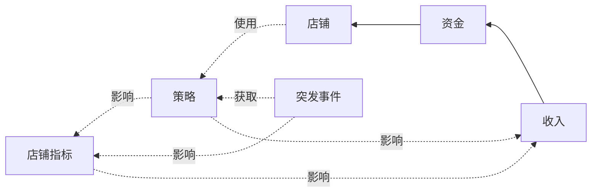

# 佳酿节 - 义卖店铺

[toc]

## 游戏目标

- 赚取足够数量的资金

## 基本逻辑



| 资金           | 店铺           | 指标           | 策略              |
| -------------- | -------------- | -------------- | ----------------- |
| 本金,收入,支出 | 小吃,百货,花卉 | 质量,效率,服务 | 提升指标,增加收入 |

## 玩家可以进行的操作

- 进入某家店铺

  - 通过花费资金增加某项指标

  - 选择策略卡

- 结算本轮

- 应对突发事件


## 可视化窗口

```mermaid
graph LR
Manage --> ShopWidget
ShopWidget --> Manage